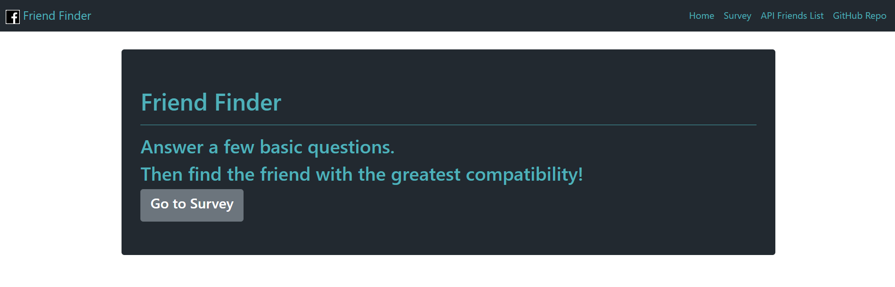
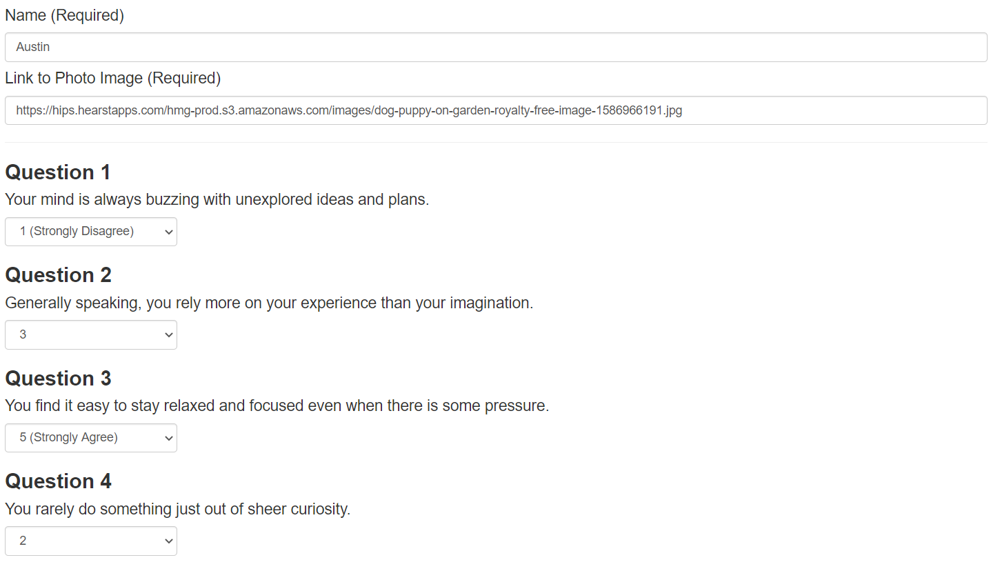
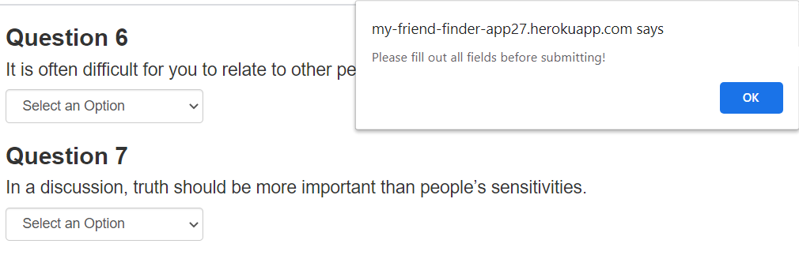
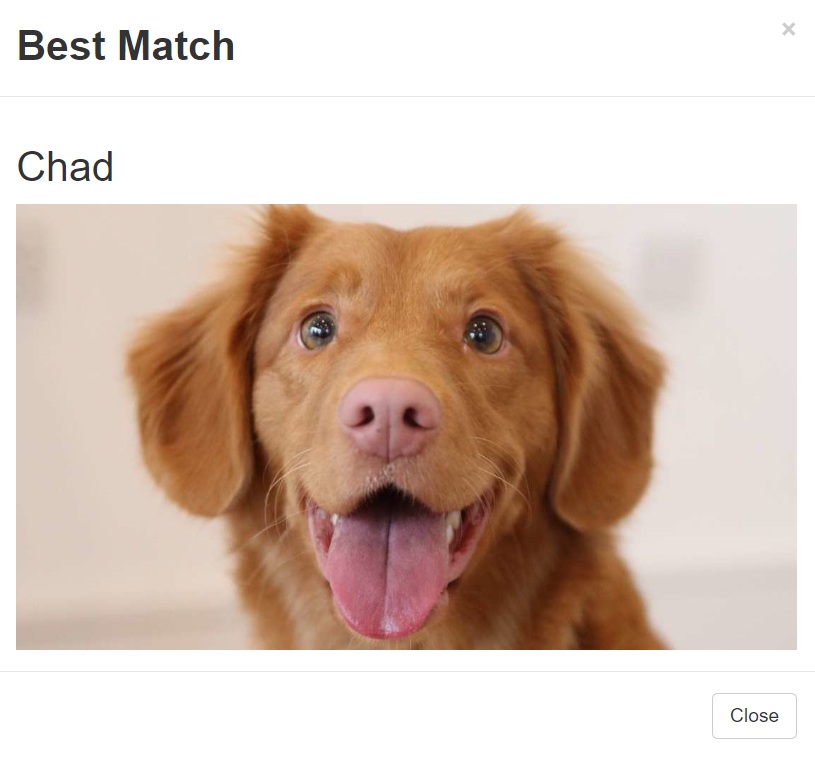
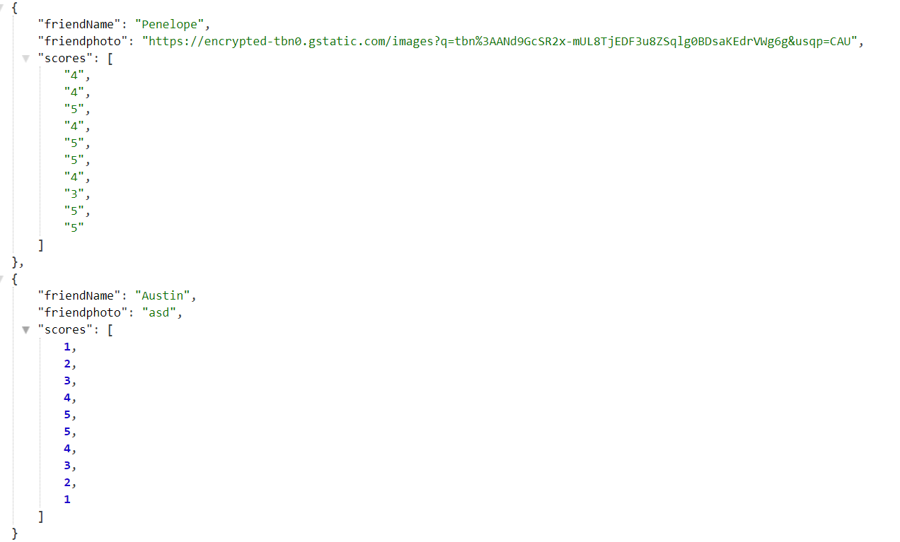

# FriendFinder

Project Link: https://my-friend-finder-app27.herokuapp.com/

# Project Description

In this project, a compatibility-based "FriendFinder" application was created. This full-stack site will take in results from a survey users take, and then compare their answers with those from other users. The app will then display the name and picture of the user with the best overall match.

# Used/ Required Packages
● Express- allows the ease of diverting users to different parts of the website based on the request that is made. 
● Path- so that paths can be easily made to the apis. 
    -The user will not have to install any of these packages if they go through Heroku, though if the server.js file is used, the Express package will be required to be installed in order to run the server.

# How It Works

● The user will be brought to the home page where they will have the option of either clicking on the <b>"Go to Survey"</b> button, or on the navbar to access the survey that they will be participating in.  
   

● The user will have to fill out their name and an image link to be populated to the API Friends List after they click the submit button. They will then be asked 10 different questions and they will have to respond to them accordingly, with 1 being a strong disagreement, and 5 being in strong agreement.  
   

● One thing the user will need to be aware of is that if they do not fill out one of the fields, the page will not let them continue on until they have filled out the name, image link, and all the questions.  
   

● After the user has filled in everything on the page and the submit button is clicked, a modal will pop up showing them the friend inside of the API Friends List that best corresponds to their answers.  
   

● Also, after the user has clicked the submit button, the information that they provided will be populated to the API Friends List page, but there is no storage so when the webpage is closed out and reopened the users data will not be present in the list anymore.  
  
